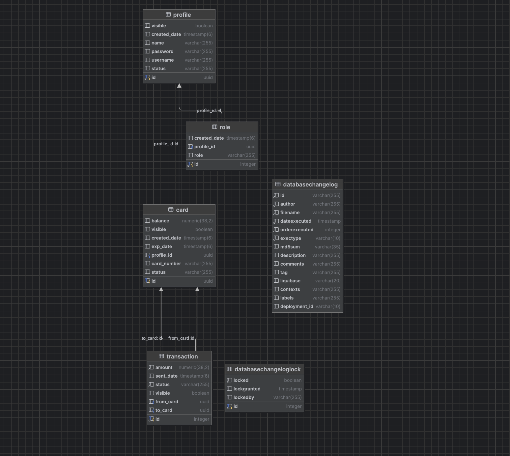

Bank Card Management System

This project is a Bank Card Management System that allows users and admins to manage bank cards efficiently. Built with Spring Boot, JPA, Liquibase, and JWT, it provides secure and structured REST APIs.

Main Features
1. User Features

Registration & Login with JWT authentication.

Add Card: Users can add bank cards to their profile.

View Cards: Users can view only their own cards.

Change Card Status: Card statuses include ACTIVE, BLOCKED, EXPIRED, and REQUEST_BLOCK.

Delete Card: Soft delete (only visible=false is set).

2. Admin Features

Profile Management:

Retrieve all user profiles (getProfiles).

Retrieve a profile by ID (getProfileById).

Soft delete a profile (deleteProfileById).

Change profile status (changeStatus).

Card Management: View all cards and control their statuses.

3. Security

JWT tokens secure API endpoints.

Role-based Access Control (RBAC): Roles include ROLE_USER and ROLE_ADMIN.

Sensitive information (like passwords) is stored securely using MD5 hashing.

4. Database

Uses PostgreSQL.

Liquibase manages database versioning and schema migrations.

Enum types and check constraints ensure valid status values.

5. Architecture

Backend built with Spring Boot 3.x.

JPA/Hibernate for ORM.

Follows Service-Repository-Controller pattern.

Uses DTOs to structure data returned to clients.

DB structure

